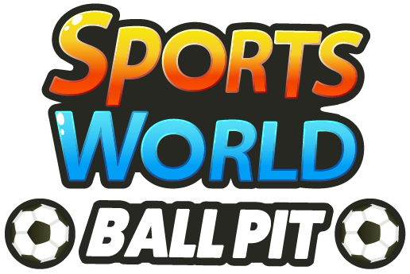

<p align="center">
  
</p>

<p align="center">
  Sports World; Ball Pit is a puzzle game made for Cool Games. Ball Pit is a variant of Bejeweled in the intellectual property of Sports World. This project is for the 'Proeve van Bekwaamheid' of Mediacollege Amsterdam. 
</p>

[](https://github.com/kevinboogaard/Sports_World-Ball_Pit)
[](https://github.com/kevinboogaard/Sports_World-Ball_Pit)
[](https://github.com/kevinboogaard/Sports_World-Ball_Pit)

## Getting Started

These instructions will get you a copy of the project up and running on your local machine for development and testing purposes. See deployment for notes on how to deploy the project on a live system.

### Prerequisites

What things you need to install the software and how to install them

```
- Git ( For example: https://git-scm.com/downloads/ )
- Apache ( For example: http://www.wampserver.com/en/ )
```

### Installing

A step by step series of examples that tell you have to get a development env running

As first, clone our project  by using either Git or checkout with SVN using the web URL: https://github.com/kevinboogaard/Sports_World-Ball_Pit.git.

```
git clone https://github.com/kevinboogaard/Sports_World-Ball_Pit.git
```

And second, run apache and set the www directory towards the folder you cloned with git.

```
DocumentRoot "C:Path\To\Cloned\Folder\Of\Sports World- Ball pit"
<Directory "C:Path\To\Cloned\Folder\Of\Sports World- Ball pit">
```

And as last, listen to port 8080.

```
Listen 0.0.0.0:8080
Listen [::0]:8080
```

Now you can enter: "localhost:8080" as a web url to play the game on a local machine.

To play the game on the live servers head over to one of these addresses:
(Recommended) Live: http://www.alex-antonides.com/pvb/ 
Development: http://dev.alex-antonides.com/pvb/ 

## Built With

* [Phaser](https://phaser.io/) - The game framework we use.
* [jQuery](https://jquery.com/) - The javascript library we use for the website.
* [TweenLite](https://greensock.com/tweenlite) - The javascript plugin we use for tweens on the website.
* [WebFontLoader](https://github.com/typekit/webfontloader) - The plugin we use to load fonts in-game.

## Authors

Alex Antonides, Jennifer Versteeg, Frederiqué Gesbert, Kevin Boogaard, Lorenzo Koning, Sabrina Rahali El Bairi and Susan van der Puijl

* **Kevin Boogaard** - *Project Lead / Developer* - [Website](http://www.kevinboogaard.com/)

* **Alex Antonides** - *Lead Developer* - [Website](http://www.alex-antonides.com/)
* **Jennifer Versteeg** - *Lead Artist* - [Website](http://www.jenniferversteeg.nl/)

* **Frederiqué Gesbert** - *Artist* - [Website](http://www.frederiquegesbert.nl/)
* **Lorenzo Koning** - *Artist* - [Website](http://www.lorenzokoning.nl/)
* **Sabrina Rahali El Bairi** - *Artist* - [Website](http://www.sabrinarahali.com/)
* **Susan van der Puijl** - *Artist* - [Website](http://www.susan-vanderpuijl.nl/)

## License

This project is licensed under the MIT License - see the [LICENSE.md](https://github.com/kevinboogaard/Sports_World-Ball_Pit/blob/master/LICENSE) file for details
